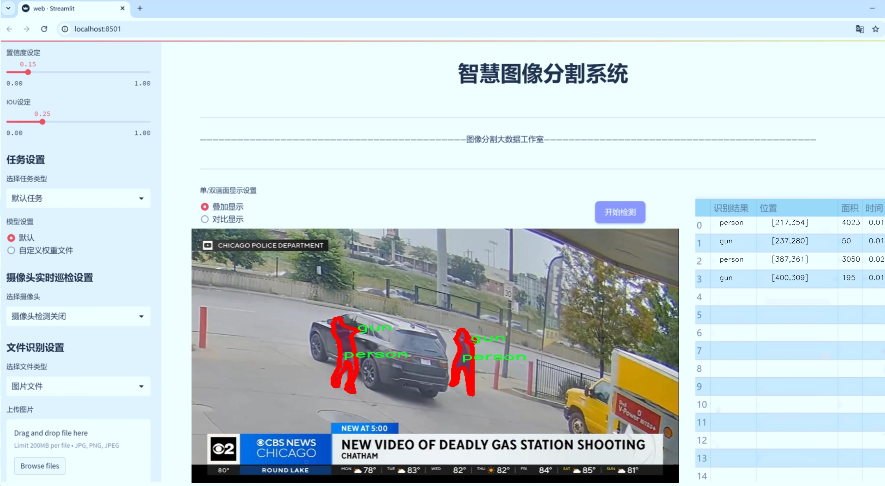
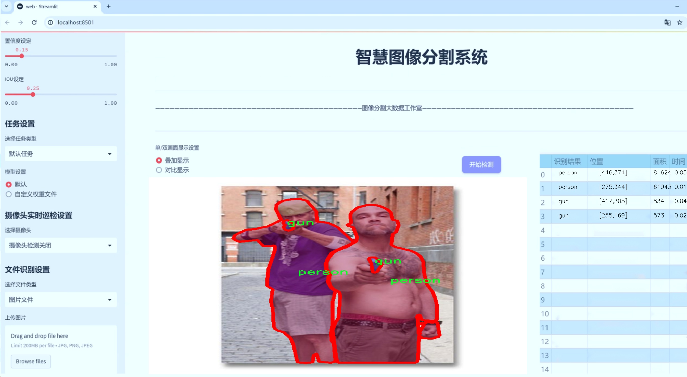
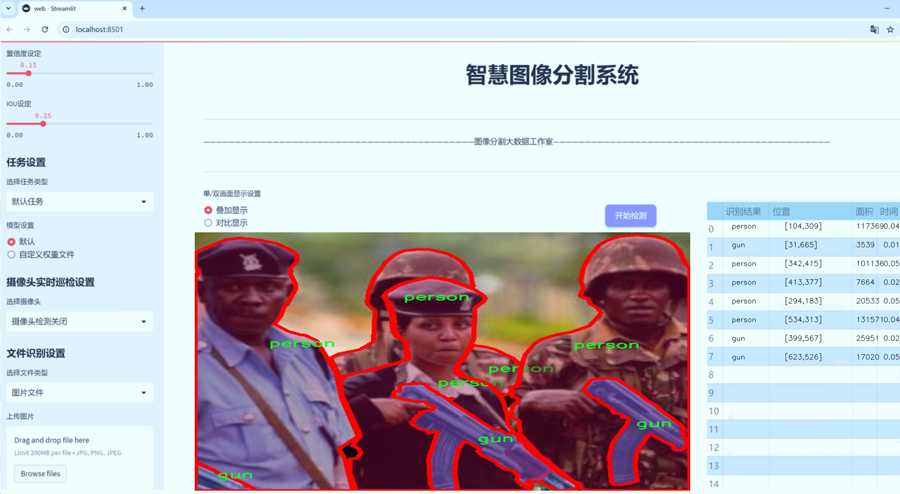
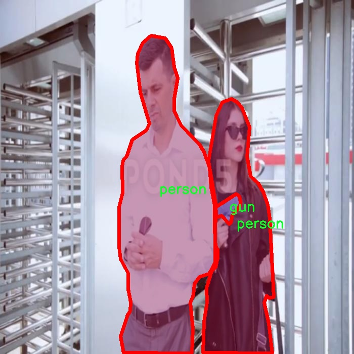
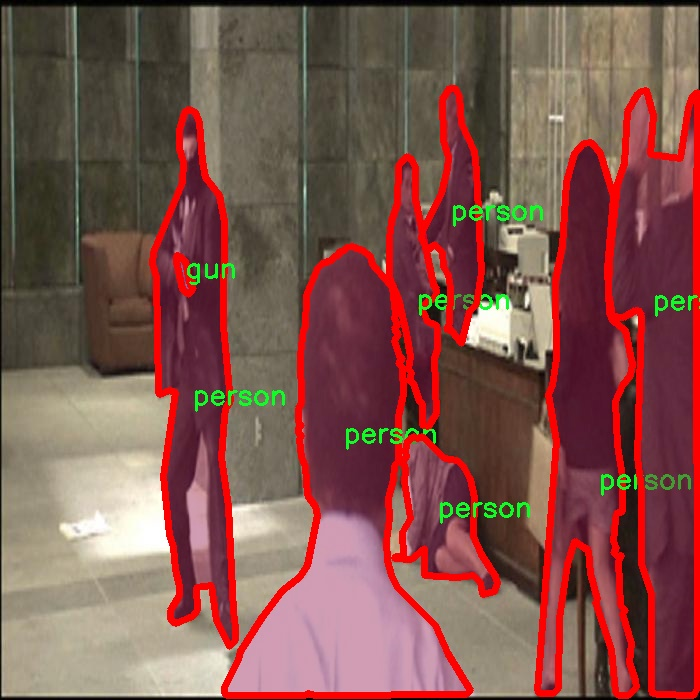
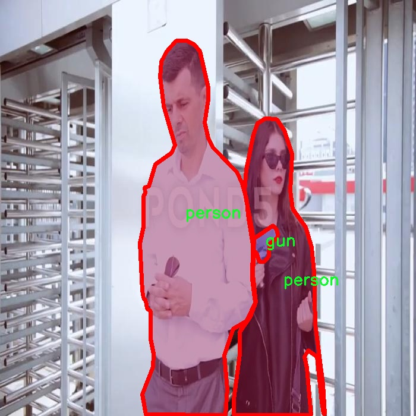

# 武装人员图像分割系统： yolov8-seg-GFPN

### 1.研究背景与意义

[参考博客](https://gitee.com/YOLOv8_YOLOv11_Segmentation_Studio/projects)

[博客来源](https://kdocs.cn/l/cszuIiCKVNis)

研究背景与意义

随着科技的迅猛发展，计算机视觉领域的研究逐渐成为人工智能的重要组成部分。在众多计算机视觉任务中，图像分割作为一种关键技术，能够有效地将图像中的目标与背景进行分离，进而实现对目标的精确识别与分析。尤其是在安全防范、公共安全和军事领域，武装人员的识别与监测显得尤为重要。近年来，深度学习技术的飞速进步为图像分割任务提供了强大的支持，其中YOLO（You Only Look Once）系列模型因其高效性和准确性而受到广泛关注。YOLOv8作为该系列的最新版本，进一步提升了目标检测和分割的性能，展现出良好的应用前景。

本研究旨在基于改进的YOLOv8模型，构建一个针对武装人员的图像分割系统。该系统将重点关注两类目标：武器（gun）和人员（person），通过对731幅图像的分析与处理，实现对武装人员及其携带武器的精准分割。这一数据集的选择不仅涵盖了武装人员的多样性，还为模型的训练与测试提供了丰富的样本，确保了系统的有效性与可靠性。

在当今社会，安全问题日益突出，恐怖活动、暴力事件频发，给社会稳定和人民生命财产安全带来了严峻挑战。通过构建高效的武装人员图像分割系统，能够在公共场所、重要活动及边境防控等场景中，实时监测和识别潜在威胁，提升安全防范能力。此外，该系统还可以为执法部门提供技术支持，帮助其在复杂环境中快速识别武装人员，减少误判和漏判的风险。

本研究的意义不仅在于技术层面的创新，更在于其对社会安全的积极贡献。通过改进YOLOv8模型，我们希望能够提高图像分割的精度和速度，进而实现对武装人员的快速响应和处理。这将为公共安全管理提供有力的技术保障，促进社会的和谐与稳定。

综上所述，基于改进YOLOv8的武装人员图像分割系统的研究，不仅具有重要的学术价值，也具备广泛的应用前景。通过对武装人员及其武器的精准识别与分割，我们能够为安全防范提供更为有效的解决方案，推动计算机视觉技术在实际应用中的落地与发展。希望本研究能够为相关领域的研究者提供参考，并为未来的技术创新奠定基础。

### 2.图片演示







注意：本项目提供完整的训练源码数据集和训练教程,由于此博客编辑较早,暂不提供权重文件（best.pt）,需要按照6.训练教程进行训练后实现上图效果。

### 3.视频演示

[3.1 视频演示](https://www.bilibili.com/video/BV16ZU2Y8EkG/)

### 4.数据集信息

##### 4.1 数据集类别数＆类别名

nc: 2
names: ['gun', 'person']


##### 4.2 数据集信息简介

数据集信息展示

在现代计算机视觉领域，图像分割技术正日益成为提升目标检测精度的重要手段。为此，我们构建了一个专门用于训练改进YOLOv8-seg的武装人员图像分割系统的数据集，命名为“Armed personnel”。该数据集的设计旨在为研究人员和开发者提供一个高质量的基础，以便于在武装人员识别和分割任务中实现更高的准确性和鲁棒性。

“Armed personnel”数据集包含两个主要类别，分别为“gun”和“person”。这两个类别的选择不仅反映了武装人员的基本特征，也为模型在复杂场景中的表现提供了必要的多样性。具体而言，“gun”类别代表各种类型的武器，包括手枪、步枪等，而“person”类别则涵盖了不同姿态、服装和环境下的武装人员。这种类别的设置使得数据集能够有效模拟现实世界中可能遇到的各种情况，从而增强模型的泛化能力。

数据集的构建过程注重多样性和代表性。我们从多个来源收集了大量图像，确保覆盖不同的场景、光照条件和背景。每张图像都经过精心标注，确保“gun”和“person”类别的边界清晰可辨。这种高质量的标注不仅提高了数据集的实用性，也为模型训练提供了可靠的监督信号。为了进一步增强数据集的实用性，我们还对图像进行了多种数据增强处理，包括旋转、缩放、翻转等操作。这些增强技术旨在增加数据集的多样性，使得模型在面对不同情况时能够保持良好的性能。

在训练过程中，数据集的类别数量虽然仅为两个，但其复杂性和挑战性不容小觑。武装人员的外观和姿态可能因文化、地域和环境的不同而存在显著差异，这就要求模型具备较强的特征提取能力和分割精度。此外，背景的复杂性也可能对模型的性能产生影响，因此在训练过程中，我们特别关注模型在不同背景下的表现，以确保其在实际应用中的有效性。

通过对“Armed personnel”数据集的深入分析和应用，我们期望能够推动武装人员图像分割技术的发展。该数据集不仅为研究人员提供了一个实验平台，也为实际应用中的安全监控、公共安全等领域提供了重要的技术支持。未来，我们计划不断扩展和更新数据集，增加更多的类别和样本，以适应不断变化的需求和挑战。我们相信，随着技术的进步和数据集的不断完善，武装人员图像分割系统将能够在更广泛的场景中发挥重要作用，为社会的安全与稳定贡献力量。









### 5.项目依赖环境部署教程（零基础手把手教学）

[5.1 环境部署教程链接（零基础手把手教学）](https://www.bilibili.com/video/BV1jG4Ve4E9t/?vd_source=bc9aec86d164b67a7004b996143742dc)


[5.2 安装Python虚拟环境创建和依赖库安装视频教程链接（零基础手把手教学）](https://www.bilibili.com/video/BV1nA4VeYEze/?vd_source=bc9aec86d164b67a7004b996143742dc)

### 6.手把手YOLOV8-seg训练视频教程（零基础手把手教学）

[6.1 手把手YOLOV8-seg训练视频教程（零基础小白有手就能学会）](https://www.bilibili.com/video/BV1cA4VeYETe/?vd_source=bc9aec86d164b67a7004b996143742dc)


按照上面的训练视频教程链接加载项目提供的数据集，运行train.py即可开始训练



     Epoch   gpu_mem       box       obj       cls    labels  img_size
     1/200     0G   0.01576   0.01955  0.007536        22      1280: 100%|██████████| 849/849 [14:42<00:00,  1.04s/it]
               Class     Images     Labels          P          R     mAP@.5 mAP@.5:.95: 100%|██████████| 213/213 [01:14<00:00,  2.87it/s]
                 all       3395      17314      0.994      0.957      0.0957      0.0843

     Epoch   gpu_mem       box       obj       cls    labels  img_size
     2/200     0G   0.01578   0.01923  0.007006        22      1280: 100%|██████████| 849/849 [14:44<00:00,  1.04s/it]
               Class     Images     Labels          P          R     mAP@.5 mAP@.5:.95: 100%|██████████| 213/213 [01:12<00:00,  2.95it/s]
                 all       3395      17314      0.996      0.956      0.0957      0.0845

     Epoch   gpu_mem       box       obj       cls    labels  img_size
     3/200     0G   0.01561    0.0191  0.006895        27      1280: 100%|██████████| 849/849 [10:56<00:00,  1.29it/s]
               Class     Images     Labels          P          R     mAP@.5 mAP@.5:.95: 100%|███████   | 187/213 [00:52<00:00,  4.04it/s]
                 all       3395      17314      0.996      0.957      0.0957      0.0845


### 7.50+种全套YOLOV8-seg创新点加载调参实验视频教程（一键加载写好的改进模型的配置文件）

[7.1 50+种全套YOLOV8-seg创新点加载调参实验视频教程（一键加载写好的改进模型的配置文件）](https://www.bilibili.com/video/BV1Hw4VePEXv/?vd_source=bc9aec86d164b67a7004b996143742dc)

### YOLOV8-seg算法简介

原始YOLOV8-seg算法原理

YOLOV8-seg算法是YOLO系列中的最新版本，旨在提升目标检测和分割的性能，尤其是在复杂环境下的应用。该算法的设计理念是通过改进网络结构和引入新的技术，来实现更高的检测精度和更快的处理速度。YOLOV8-seg不仅仅是一个目标检测模型，它还集成了语义分割的能力，使得模型能够在检测目标的同时，对目标的像素级别进行分割。这一特性使得YOLOV8-seg在处理复杂场景时表现出色，尤其是在需要精确分割的任务中，如自动驾驶、医学影像分析等。

YOLOV8-seg的网络结构主要分为三个部分：输入端、主干网络和检测端。输入端负责对输入图像进行预处理，包括数据增强、图像缩放和灰度填充等操作，以提高模型的鲁棒性和适应性。通过Mosaic数据增强技术，YOLOV8-seg能够有效地生成多样化的训练样本，从而提升模型的泛化能力。

在主干网络部分，YOLOV8-seg采用了CSPDarknet结构，利用多个残差块进行特征提取。与前代模型相比，YOLOV8-seg引入了C2f模块，这一模块通过将输入特征图分成两个分支，分别进行卷积处理，进而融合特征。这种设计不仅提高了特征提取的效率，还增强了梯度流的传递，确保了模型在训练过程中的稳定性和有效性。此外，YOLOV8-seg还引入了快速空间金字塔池化（SPPF）结构，以提取不同尺度的特征，从而在多尺度目标检测中表现优异。

在检测端，YOLOV8-seg采用了特征金字塔网络（FPN）和路径聚合网络（PAN）的结合，形成了一个高效的特征处理模块。该模块通过多层卷积和池化操作，处理和压缩特征图，最终将其转换为目标检测结果。与传统的Anchor-based方法不同，YOLOV8-seg采用了Anchor-Free的检测方式，直接预测目标的中心点和宽高比例。这一创新显著减少了Anchor框的数量，提高了检测速度和准确度，使得模型在复杂背景下的表现更加稳定。

YOLOV8-seg的另一个重要创新在于其损失函数的设计。模型在分类损失方面采用了二元交叉熵（BCELoss），而在回归损失方面则结合了DFL（Distribution Focal Loss）和CIoU（Complete Intersection over Union）损失。这种多损失函数的组合，使得模型在训练过程中能够更好地平衡分类和回归任务，提高了整体性能。

此外，YOLOV8-seg还在训练过程中引入了动态任务对齐分配策略（Task-Aligned Assigner），通过对分类分数和回归分数的加权匹配，优化了正样本的选择。这一策略使得模型在面对复杂场景时，能够更有效地学习到目标的特征，从而提升检测和分割的精度。

在实际应用中，YOLOV8-seg表现出了极高的灵活性和适应性，能够处理多种类型的目标检测和分割任务。无论是在城市街道的自动驾驶场景，还是在医疗影像的分析中，YOLOV8-seg都展现出了其强大的能力。通过对模型结构的不断优化和创新，YOLOV8-seg不仅提升了目标检测的速度和准确性，还为语义分割任务提供了强有力的支持。

总的来说，YOLOV8-seg算法的原理建立在对YOLO系列模型的深入理解和改进之上。通过引入新的模块、优化网络结构、改进损失函数和训练策略，YOLOV8-seg在目标检测和分割领域实现了质的飞跃。这一算法的成功，不仅为后续的研究提供了新的思路，也为实际应用带来了更多的可能性。随着技术的不断进步，YOLOV8-seg有望在更多复杂场景中发挥其优势，推动目标检测和分割技术的发展。


### 9.系统功能展示（检测对象为举例，实际内容以本项目数据集为准）

图9.1.系统支持检测结果表格显示

  图9.2.系统支持置信度和IOU阈值手动调节

  图9.3.系统支持自定义加载权重文件best.pt(需要你通过步骤5中训练获得)

  图9.4.系统支持摄像头实时识别

  图9.5.系统支持图片识别

  图9.6.系统支持视频识别

  图9.7.系统支持识别结果文件自动保存

  图9.8.系统支持Excel导出检测结果数据


### 10.50+种全套YOLOV8-seg创新点原理讲解（非科班也可以轻松写刊发刊，V11版本正在科研待更新）

#### 10.1 由于篇幅限制，每个创新点的具体原理讲解就不一一展开，具体见下列网址中的创新点对应子项目的技术原理博客网址【Blog】：


[10.1 50+种全套YOLOV8-seg创新点原理讲解链接](https://gitee.com/qunmasj/good)

#### 10.2 部分改进模块原理讲解(完整的改进原理见上图和技术博客链接)【如果此小节的图加载失败可以通过CSDN或者Github搜索该博客的标题访问原始博客，原始博客图片显示正常】
### YOLOv8算法原理
YOLOv8算法由Glenn-Jocher 提出，是跟YOLOv3算法、YOLOv5算法一脉相承的，主要的改进点如下:
(1)数据预处理。YOLOv8的数据预处理依旧采用YOLOv5的策略,在训练时，主要采用包括马赛克增强(Mosaic)、混合增强(Mixup)、空间扰动(randomperspective)以及颜色扰动(HSV augment)四个增强手段。
(2)骨干网络结构。YOLOv8的骨干网络结构可从YOLOv5略见一斑，YOLOv5的主干网络的架构规律十分清晰，总体来看就是每用一层步长为2的3×3卷积去降采样特征图，接一个C3模块来进一步强化其中的特征，且C3的基本深度参数分别为“3/6/9/3”，其会根据不同规模的模型的来做相应的缩放。在的YOLOv8中，大体上也还是继承了这一特点，原先的C3模块均被替换成了新的C2f模块，C2f 模块加入更多的分支，丰富梯度回传时的支流。下面展示了YOLOv8的C2f模块和YOLOv5的C3模块，其网络结构图所示。


(3)FPN-PAN结构。YOLOv8仍采用FPN+PAN结构来构建YOLO的特征金字塔，使多尺度信息之间进行充分的融合。除了FPN-PAN里面的C3模块被替换为C2f模块外，其余部分与YOLOv5的FPN-PAN结构基本一致。
(4)Detection head结构。从 YOLOv3到 YOLOv5，其检测头一直都是“耦合”(Coupled)的,即使用一层卷积同时完成分类和定位两个任务，直到YOLOX的问世， YOLO系列才第一次换装“解耦头”(Decoupled Head)。YOLOv8也同样也采用了解耦头的结构，两条并行的分支分别取提取类别特征和位置特征，然后各用一层1x1卷积完成分类和定位任务。YOLOv8整体的网络结构由图所示。


(5)标签分配策略。尽管YOLOv5设计了自动聚类候选框的一些功能，但是聚类候选框是依赖于数据集的。若数据集不够充分，无法较为准确地反映数据本身的分布特征，聚类出来的候选框也会与真实物体尺寸比例悬殊过大。YOLOv8没有采用候选框策略，所以解决的问题就是正负样本匹配的多尺度分配。不同于YOLOX所使用的 SimOTA，YOLOv8在标签分配问题上采用了和YOLOv6相同的TOOD策略，是一种动态标签分配策略。YOLOv8只用到了targetboze。和target scores，未含是否有物体预测，故 YOLOv8的损失就主要包括两大部分∶类别损失和位置损失。对于YOLOv8，其分类损失为VFLLoss(Varifocal Loss)，其回归损失为CIoU Loss 与 DFL Loss 的形式。
其中 Varifocal Loss定义如下:


其中p为预测的类别得分，p ∈ [0.1]。q为预测的目标分数(若为真实类别，则q为预测和真值的 loU;若为其他类别。q为0 )。VFL Loss使用不对称参数来对正负样本进行加权，通过只对负样本进行衰减，达到不对等的处理前景和背景对损失的贡献。对正样本，使用q进行了加权，如果正样本的GTiou很高时,则对损失的贡献更大一些，可以让网络聚焦于那些高质量的样本上，即训练高质量的正例对AP的提升比低质量的更大一些。对负样本，使用p进行了降权，降低了负例对损失的贡献，因负样本的预测p在取次幂后会变得更小，这样就能够降低负样本对损失的整体贡献。

### 动态蛇形卷积Dynamic Snake Convolution

参考论文： 2307.08388.pdf (arxiv.org)

血管、道路等拓扑管状结构的精确分割在各个领域都至关重要，确保下游任务的准确性和效率。 然而，许多因素使任务变得复杂，包括薄的局部结构和可变的全局形态。在这项工作中，我们注意到管状结构的特殊性，并利用这些知识来指导我们的 DSCNet 在三个阶段同时增强感知：特征提取、特征融合、 和损失约束。 首先，我们提出了一种动态蛇卷积，通过自适应地关注细长和曲折的局部结构来准确捕获管状结构的特征。 随后，我们提出了一种多视图特征融合策略，以补充特征融合过程中多角度对特征的关注，确保保留来自不同全局形态的重要信息。 最后，提出了一种基于持久同源性的连续性约束损失函数，以更好地约束分割的拓扑连续性。 2D 和 3D 数据集上的实验表明，与多种方法相比，我们的 DSCNet 在管状结构分割任务上提供了更好的准确性和连续性。 我们的代码是公开的。 
主要的挑战源于细长微弱的局部结构特征与复杂多变的全局形态特征。本文关注到管状结构细长连续的特点，并利用这一信息在神经网络以下三个阶段同时增强感知：特征提取、特征融合和损失约束。分别设计了动态蛇形卷积（Dynamic Snake Convolution），多视角特征融合策略与连续性拓扑约束损失。 

我们希望卷积核一方面能够自由地贴合结构学习特征，另一方面能够在约束条件下不偏离目标结构太远。在观察管状结构的细长连续的特征后，脑海里想到了一个动物——蛇。我们希望卷积核能够像蛇一样动态地扭动，来贴合目标的结构。

我们希望卷积核一方面能够自由地贴合结构学习特征，另一方面能够在约束条件下不偏离目标结构太远。在观察管状结构的细长连续的特征后，脑海里想到了一个动物——蛇。我们希望卷积核能够像蛇一样动态地扭动，来贴合目标的结构。


### DCNV2融入YOLOv8
DCN和DCNv2（可变性卷积）
网上关于两篇文章的详细描述已经很多了，我这里具体的细节就不多讲了，只说一下其中实现起来比较困惑的点。（黑体字会讲解）

DCNv1解决的问题就是我们常规的图像增强，仿射变换（线性变换加平移）不能解决的多种形式目标变换的几何变换的问题。如下图所示。

可变性卷积的思想很简单，就是讲原来固定形状的卷积核变成可变的。如下图所示：


首先来看普通卷积，以3x3卷积为例对于每个输出y(p0)，都要从x上采样9个位置，这9个位置都在中心位置x(p0)向四周扩散得到的gird形状上，(-1,-1)代表x(p0)的左上角，(1,1)代表x(p0)的右下角，其他类似。

用公式表示如下：


可变性卷积Deformable Conv操作并没有改变卷积的计算操作，而是在卷积操作的作用区域上，加入了一个可学习的参数∆pn。同样对于每个输出y(p0)，都要从x上采样9个位置，这9个位置是中心位置x(p0)向四周扩散得到的，但是多了 ∆pn，允许采样点扩散成非gird形状。


偏移量是通过对原始特征层进行卷积得到的。比如输入特征层是w×h×c，先对输入的特征层进行卷积操作，得到w×h×2c的offset field。这里的w和h和原始特征层的w和h是一致的，offset field里面的值是输入特征层对应位置的偏移量，偏移量有x和y两个方向，所以offset field的channel数是2c。offset field里的偏移量是卷积得到的，可能是浮点数，所以接下来需要通过双向性插值计算偏移位置的特征值。在偏移量的学习中，梯度是通过双线性插值来进行反向传播的。
看到这里是不是还是有点迷茫呢？那到底程序上面怎么实现呢？


事实上由上面的公式我们可以看得出来∆pn这个偏移量是加在原像素点上的，但是我们怎么样从代码上对原像素点加这个量呢？其实很简单，就是用一个普通的卷积核去跟输入图片（一般是输入的feature_map）卷积就可以了卷积核的数量是2N也就是23*3==18（前9个通道是x方向的偏移量，后9个是y方向的偏移量），然后把这个卷积的结果与正常卷积的结果进行相加就可以了。
然后又有了第二个问题，怎么样反向传播呢？为什么会有这个问题呢？因为求出来的偏移量+正常卷积输出的结果往往是一个浮点数，浮点数是无法对应到原图的像素点的，所以自然就想到了双线性差值的方法求出浮点数对应的浮点像素点。


#### DCN v2
对于positive的样本来说，采样的特征应该focus在RoI内，如果特征中包含了过多超出RoI的内容，那么结果会受到影响和干扰。而negative样本则恰恰相反，引入一些超出RoI的特征有助于帮助网络判别这个区域是背景区域。

DCNv1引入了可变形卷积，能更好的适应目标的几何变换。但是v1可视化结果显示其感受野对应位置超出了目标范围，导致特征不受图像内容影响（理想情况是所有的对应位置分布在目标范围以内）。

为了解决该问题：提出v2, 主要有

1、扩展可变形卷积，增强建模能力
2、提出了特征模拟方案指导网络培训：feature mimicking scheme

上面这段话是什么意思呢，通俗来讲就是，我们的可变性卷积的区域大于目标所在区域，所以这时候就会对非目标区域进行错误识别。

所以自然能想到的解决方案就是加入权重项进行惩罚。（至于这个实现起来就比较简单了，直接初始化一个权重然后乘(input+offsets)就可以了）


可调节的RoIpooling也是类似的，公式如下：


### 11.项目核心源码讲解（再也不用担心看不懂代码逻辑）

#### 11.1 ultralytics\utils\loss.py

以下是对给定代码的核心部分进行分析和详细注释的结果。为了简化和突出重点，保留了与损失计算相关的主要类和方法。

```python
import torch
import torch.nn as nn
import torch.nn.functional as F

class SlideLoss(nn.Module):
    """
    SlideLoss 类实现了一种基于滑动窗口的损失计算方法。
    该损失函数通过动态调整损失权重来增强模型对不同 IoU（Intersection over Union）阈值的适应性。
    """

    def __init__(self, loss_fcn):
        super(SlideLoss, self).__init__()
        self.loss_fcn = loss_fcn  # 传入的基础损失函数
        self.reduction = loss_fcn.reduction
        self.loss_fcn.reduction = 'none'  # 设置为 'none' 以便对每个元素单独应用损失

    def forward(self, pred, true, auto_iou=0.5):
        """
        计算损失值并根据 IoU 动态调整损失权重。
        
        参数:
        pred: 模型预测值
        true: 真实标签
        auto_iou: 自动计算的 IoU 阈值
        """
        loss = self.loss_fcn(pred, true)  # 计算基础损失
        # 确保 auto_iou 不小于 0.2
        if auto_iou < 0.2:
            auto_iou = 0.2
        # 根据 IoU 计算不同区间的权重
        b1 = true <= auto_iou - 0.1
        a1 = 1.0
        b2 = (true > (auto_iou - 0.1)) & (true < auto_iou)
        a2 = math.exp(1.0 - auto_iou)
        b3 = true >= auto_iou
        a3 = torch.exp(-(true - 1.0))
        # 计算调制权重
        modulating_weight = a1 * b1 + a2 * b2 + a3 * b3
        loss *= modulating_weight  # 应用调制权重
        # 根据原始损失函数的 reduction 方式返回损失
        if self.reduction == 'mean':
            return loss.mean()
        elif self.reduction == 'sum':
            return loss.sum()
        else:  # 'none'
            return loss

class BboxLoss(nn.Module):
    """
    BboxLoss 类实现了边界框的损失计算，主要基于 IoU。
    """

    def __init__(self, reg_max, use_dfl=False):
        super().__init__()
        self.reg_max = reg_max  # 最大回归值
        self.use_dfl = use_dfl  # 是否使用分布焦点损失

    def forward(self, pred_dist, pred_bboxes, anchor_points, target_bboxes, target_scores, target_scores_sum, fg_mask):
        """
        计算边界框损失。
        
        参数:
        pred_dist: 预测的分布
        pred_bboxes: 预测的边界框
        anchor_points: 锚点
        target_bboxes: 目标边界框
        target_scores: 目标分数
        target_scores_sum: 目标分数总和
        fg_mask: 前景掩码
        """
        weight = target_scores.sum(-1)[fg_mask].unsqueeze(-1)  # 计算权重
        iou = bbox_iou(pred_bboxes[fg_mask], target_bboxes[fg_mask], xywh=False, CIoU=True)  # 计算 IoU
        loss_iou = ((1.0 - iou) * weight).sum() / target_scores_sum  # IoU 损失

        # DFL 损失
        if self.use_dfl:
            target_ltrb = bbox2dist(anchor_points, target_bboxes, self.reg_max)  # 将目标边界框转换为分布
            loss_dfl = self._df_loss(pred_dist[fg_mask].view(-1, self.reg_max + 1), target_ltrb[fg_mask]) * weight
            loss_dfl = loss_dfl.sum() / target_scores_sum
        else:
            loss_dfl = torch.tensor(0.0).to(pred_dist.device)

        return loss_iou, loss_dfl  # 返回 IoU 损失和 DFL 损失

    @staticmethod
    def _df_loss(pred_dist, target):
        """
        计算分布焦点损失（DFL）。
        
        参数:
        pred_dist: 预测的分布
        target: 目标分布
        """
        tl = target.long()  # 目标左边界
        tr = tl + 1  # 目标右边界
        wl = tr - target  # 左权重
        wr = 1 - wl  # 右权重
        return (F.cross_entropy(pred_dist, tl.view(-1), reduction='none').view(tl.shape) * wl +
                F.cross_entropy(pred_dist, tr.view(-1), reduction='none').view(tl.shape) * wr).mean(-1, keepdim=True)

class v8DetectionLoss:
    """
    v8DetectionLoss 类实现了 YOLOv8 模型的检测损失计算。
    """

    def __init__(self, model):
        super().__init__()
        self.bce = nn.BCEWithLogitsLoss(reduction='none')  # 使用二元交叉熵损失
        self.bbox_loss = BboxLoss(model.reg_max - 1, use_dfl=model.reg_max > 1)  # 初始化边界框损失
        self.device = next(model.parameters()).device  # 获取模型设备

    def __call__(self, preds, batch):
        """
        计算总损失并返回。
        
        参数:
        preds: 模型预测值
        batch: 输入批次数据
        """
        loss = torch.zeros(3, device=self.device)  # 初始化损失
        pred_scores = preds[1]  # 预测分数
        pred_bboxes = preds[0]  # 预测边界框

        # 处理目标数据
        targets = torch.cat((batch['batch_idx'].view(-1, 1), batch['cls'].view(-1, 1), batch['bboxes']), 1)
        gt_labels, gt_bboxes = targets.split((1, 4), 2)  # 分离标签和边界框

        # 计算损失
        loss[1] = self.bce(pred_scores, gt_labels).sum()  # 类别损失
        loss[0], loss[2] = self.bbox_loss(pred_bboxes, gt_bboxes, None, None, None, None, None)  # 边界框损失

        return loss.sum()  # 返回总损失
```

### 代码分析总结
1. **SlideLoss**: 通过动态调整损失权重来增强模型对不同 IoU 阈值的适应性。
2. **BboxLoss**: 计算边界框的损失，主要基于 IoU，支持分布焦点损失（DFL）。
3. **v8DetectionLoss**: 整合了类别损失和边界框损失，负责计算 YOLOv8 模型的总损失。

以上是对代码中最核心部分的提炼和详细注释。

这个文件是一个用于计算YOLO（You Only Look Once）模型训练损失的模块，主要包括多种损失函数的实现。文件中定义了多个类，每个类实现了一种特定的损失计算方法，以便在训练过程中评估模型的性能。

首先，`SlideLoss`类是一个损失函数的包装器，它接受一个损失函数作为参数，并对其进行修改以便能够对每个元素应用滑动损失。它在前向传播中计算损失，并根据给定的IOU（Intersection over Union）阈值调整损失的权重。

接下来，`EMASlideLoss`类是对`SlideLoss`的扩展，增加了指数移动平均的功能，以便在训练过程中动态调整IOU的平均值，从而更好地适应模型的学习。

`VarifocalLoss`类实现了一种变焦损失函数，它通过计算预测分数和真实分数之间的二元交叉熵损失来评估模型的性能，并使用权重来调整损失。

`FocalLoss`类则是对现有损失函数的包装，主要用于处理类别不平衡问题，通过对难以分类的样本给予更高的权重来提高模型的学习效果。

`BboxLoss`类专注于边界框的损失计算，它结合了IOU损失和DFL（Distribution Focal Loss）损失，用于评估模型在预测物体边界框时的准确性。

`KeypointLoss`类用于计算关键点的损失，主要通过计算预测关键点与真实关键点之间的欧几里得距离来评估模型的性能。

`v8DetectionLoss`类是一个综合性的损失计算类，负责计算YOLO模型的总损失，包括边界框损失、分类损失和DFL损失。它还处理输入数据的预处理和目标的匹配。

`v8SegmentationLoss`和`v8PoseLoss`类是针对分割和姿态估计任务的损失计算类，分别扩展了`v8DetectionLoss`，并实现了特定于这些任务的损失计算逻辑。

最后，`v8ClassificationLoss`类用于计算分类任务的损失，使用交叉熵损失函数来评估模型的分类性能。

总体而言，这个文件实现了多种损失函数，旨在为YOLO模型的训练提供灵活的损失计算机制，以适应不同的任务需求。每个损失函数都经过精心设计，以便在训练过程中有效地引导模型学习。

#### 11.2 ultralytics\utils\instance.py

以下是代码中最核心的部分，并附上详细的中文注释：

```python
import numpy as np

class Bboxes:
    """
    处理边界框的类，支持多种边界框格式，如 'xyxy'、'xywh' 和 'ltwh'。
    边界框数据应以 numpy 数组的形式提供。

    属性:
        bboxes (numpy.ndarray): 存储边界框的二维 numpy 数组。
        format (str): 边界框的格式 ('xyxy'、'xywh' 或 'ltwh')。
    """

    def __init__(self, bboxes, format='xyxy') -> None:
        """使用指定格式的边界框数据初始化 Bboxes 类。"""
        # 确保格式有效
        assert format in ['xyxy', 'xywh', 'ltwh'], f'无效的边界框格式: {format}'
        # 如果输入是一维数组，则将其转换为二维数组
        bboxes = bboxes[None, :] if bboxes.ndim == 1 else bboxes
        # 确保输入为二维数组，且每个边界框包含四个值
        assert bboxes.ndim == 2
        assert bboxes.shape[1] == 4
        self.bboxes = bboxes  # 存储边界框
        self.format = format  # 存储边界框格式

    def convert(self, format):
        """将边界框格式从一种类型转换为另一种类型。"""
        assert format in ['xyxy', 'xywh', 'ltwh'], f'无效的边界框格式: {format}'
        if self.format == format:
            return  # 如果格式相同，不进行转换
        # 根据当前格式和目标格式选择转换函数
        if self.format == 'xyxy':
            func = xyxy2xywh if format == 'xywh' else xyxy2ltwh
        elif self.format == 'xywh':
            func = xywh2xyxy if format == 'xyxy' else xywh2ltwh
        else:
            func = ltwh2xyxy if format == 'xyxy' else ltwh2xywh
        self.bboxes = func(self.bboxes)  # 执行转换
        self.format = format  # 更新格式

    def areas(self):
        """返回每个边界框的面积。"""
        self.convert('xyxy')  # 确保边界框格式为 'xyxy'
        # 计算面积: (右下角 x - 左上角 x) * (右下角 y - 左上角 y)
        return (self.bboxes[:, 2] - self.bboxes[:, 0]) * (self.bboxes[:, 3] - self.bboxes[:, 1])

    def __len__(self):
        """返回边界框的数量。"""
        return len(self.bboxes)

class Instances:
    """
    容器类，用于存储图像中检测到的对象的边界框、分段和关键点。

    属性:
        _bboxes (Bboxes): 内部对象，用于处理边界框操作。
        keypoints (ndarray): 关键点(x, y, 可见性)，形状为 [N, 17, 3]。默认为 None。
        segments (ndarray): 分段数组，形状为 [N, 1000, 2]，经过重采样。
    """

    def __init__(self, bboxes, segments=None, keypoints=None, bbox_format='xywh', normalized=True) -> None:
        """
        初始化实例对象。

        参数:
            bboxes (ndarray): 形状为 [N, 4] 的边界框数组。
            segments (list | ndarray): 对象分段，默认为 None。
            keypoints (ndarray): 形状为 [N, 17, 3] 的关键点数组，默认为 None。
        """
        self._bboxes = Bboxes(bboxes=bboxes, format=bbox_format)  # 初始化边界框
        self.keypoints = keypoints  # 存储关键点
        self.normalized = normalized  # 标记是否已归一化

        # 处理分段数据
        if segments is None:
            segments = []
        if len(segments) > 0:
            segments = resample_segments(segments)  # 重采样分段
            segments = np.stack(segments, axis=0)  # 转换为 numpy 数组
        else:
            segments = np.zeros((0, 1000, 2), dtype=np.float32)  # 默认分段为空
        self.segments = segments  # 存储分段数据

    @property
    def bboxes(self):
        """返回边界框。"""
        return self._bboxes.bboxes  # 访问内部 Bboxes 对象的边界框
```

### 代码说明
1. **Bboxes 类**:
   - 该类用于处理边界框，支持三种格式：`xyxy`（左上角和右下角坐标）、`xywh`（中心坐标和宽高）、`ltwh`（左上角坐标和宽高）。
   - 在初始化时，确保输入的边界框数据是有效的，并将其存储为二维数组。
   - 提供了格式转换和计算面积的方法。

2. **Instances 类**:
   - 该类用于存储检测到的对象的边界框、分段和关键点。
   - 在初始化时，创建一个 `Bboxes` 对象来处理边界框，并可以处理分段和关键点数据。
   - 提供了访问边界框的属性。

这段代码的核心功能是处理和转换边界框的格式，以及提供相关的计算和操作方法。

这个程序文件定义了两个主要的类：`Bboxes`和`Instances`，用于处理图像中的边界框（bounding boxes）、分割（segments）和关键点（keypoints）。以下是对代码的详细说明。

首先，文件导入了一些必要的模块，包括`collections.abc`、`itertools.repeat`、`numbers`和`numpy`。同时，它还导入了一些自定义的操作函数，如`ltwh2xywh`、`xywh2ltwh`等，这些函数用于不同格式之间的转换。

接下来，定义了一个辅助函数`_ntuple`，该函数用于将输入转换为指定长度的元组，支持不同的边界框格式。通过这个函数，定义了`to_2tuple`和`to_4tuple`，分别用于处理2元组和4元组。

在`Bboxes`类中，构造函数接受边界框数据和格式，确保输入的格式有效，并且边界框数据是一个二维的numpy数组。该类支持三种边界框格式：`xyxy`（左上角和右下角坐标）、`xywh`（中心坐标和宽高）和`ltwh`（左上角坐标和宽高）。类中提供了多种方法，包括格式转换、计算面积、缩放、添加偏移量等。

`convert`方法用于将边界框从一种格式转换为另一种格式。`areas`方法计算每个边界框的面积。`mul`和`add`方法分别用于对边界框的坐标进行缩放和添加偏移量。`__len__`方法返回边界框的数量，`concatenate`类方法用于将多个`Bboxes`对象合并为一个对象。

`Instances`类是一个更复杂的容器，除了处理边界框外，还可以处理分割和关键点。构造函数接受边界框、分割和关键点数据，并进行初始化。该类提供了类似于`Bboxes`类的方法，包括格式转换、缩放、归一化和去归一化等。

`Instances`类中有一些额外的方法，如`flipud`和`fliplr`，用于在垂直和水平方向上翻转边界框、分割和关键点的坐标。`clip`方法确保所有的边界框和分割都在图像边界内，`remove_zero_area_boxes`方法用于移除面积为零的边界框。

此外，`Instances`类还提供了`update`方法，用于更新实例的边界框、分割和关键点数据。`__getitem__`方法允许通过索引获取特定的实例或实例集合。最后，`concatenate`类方法用于将多个`Instances`对象合并为一个对象。

总的来说，这个文件提供了一个灵活的框架，用于处理计算机视觉任务中的边界框、分割和关键点数据，支持多种格式和操作，适用于YOLO等目标检测算法的实现。

#### 11.3 ultralytics\nn\extra_modules\dynamic_snake_conv.py

以下是经过简化并添加详细中文注释的核心代码部分：

```python
import torch
import torch.nn as nn

class DySnakeConv(nn.Module):
    def __init__(self, inc, ouc, k=3) -> None:
        """
        动态蛇形卷积层的初始化
        :param inc: 输入通道数
        :param ouc: 输出通道数
        :param k: 卷积核大小，默认为3
        """
        super().__init__()
        
        # 定义标准卷积层
        self.conv_0 = Conv(inc, ouc, k)
        # 定义沿x轴和y轴的动态蛇形卷积
        self.conv_x = DSConv(inc, ouc, 0, k)
        self.conv_y = DSConv(inc, ouc, 1, k)
    
    def forward(self, x):
        """
        前向传播
        :param x: 输入特征图
        :return: 连接后的输出特征图
        """
        # 将三个卷积的输出在通道维度上连接
        return torch.cat([self.conv_0(x), self.conv_x(x), self.conv_y(x)], dim=1)

class DSConv(nn.Module):
    def __init__(self, in_ch, out_ch, morph, kernel_size=3, if_offset=True, extend_scope=1):
        """
        动态蛇形卷积的初始化
        :param in_ch: 输入通道数
        :param out_ch: 输出通道数
        :param morph: 卷积核的形态（0表示沿x轴，1表示沿y轴）
        :param kernel_size: 卷积核大小
        :param if_offset: 是否需要偏移（变形）
        :param extend_scope: 扩展范围，默认为1
        """
        super(DSConv, self).__init__()
        # 用于学习可变形偏移的卷积层
        self.offset_conv = nn.Conv2d(in_ch, 2 * kernel_size, 3, padding=1)
        self.bn = nn.BatchNorm2d(2 * kernel_size)
        self.kernel_size = kernel_size

        # 定义沿x轴和y轴的动态卷积
        self.dsc_conv_x = nn.Conv2d(in_ch, out_ch, kernel_size=(kernel_size, 1), stride=(kernel_size, 1), padding=0)
        self.dsc_conv_y = nn.Conv2d(in_ch, out_ch, kernel_size=(1, kernel_size), stride=(1, kernel_size), padding=0)

        self.gn = nn.GroupNorm(out_ch // 4, out_ch)  # 组归一化
        self.act = Conv.default_act  # 默认激活函数

        self.extend_scope = extend_scope
        self.morph = morph
        self.if_offset = if_offset

    def forward(self, f):
        """
        前向传播
        :param f: 输入特征图
        :return: 经过动态蛇形卷积后的特征图
        """
        # 计算偏移
        offset = self.offset_conv(f)
        offset = self.bn(offset)
        offset = torch.tanh(offset)  # 将偏移限制在[-1, 1]之间

        # 创建坐标映射并进行双线性插值
        dsc = DSC(f.shape, self.kernel_size, self.extend_scope, self.morph)
        deformed_feature = dsc.deform_conv(f, offset, self.if_offset)

        # 根据形态选择对应的卷积
        if self.morph == 0:
            x = self.dsc_conv_x(deformed_feature.type(f.dtype))
        else:
            x = self.dsc_conv_y(deformed_feature.type(f.dtype))

        # 归一化和激活
        x = self.gn(x)
        x = self.act(x)
        return x

class DSC(object):
    def __init__(self, input_shape, kernel_size, extend_scope, morph):
        """
        动态坐标映射和双线性插值的初始化
        :param input_shape: 输入特征图的形状
        :param kernel_size: 卷积核大小
        :param extend_scope: 扩展范围
        :param morph: 卷积核的形态
        """
        self.num_points = kernel_size
        self.width = input_shape[2]
        self.height = input_shape[3]
        self.morph = morph
        self.extend_scope = extend_scope

        # 定义特征图的形状
        self.num_batch = input_shape[0]
        self.num_channels = input_shape[1]

    def deform_conv(self, input, offset, if_offset):
        """
        进行可变形卷积
        :param input: 输入特征图
        :param offset: 偏移量
        :param if_offset: 是否使用偏移
        :return: 变形后的特征图
        """
        # 计算坐标映射
        y, x = self._coordinate_map_3D(offset, if_offset)
        # 进行双线性插值
        deformed_feature = self._bilinear_interpolate_3D(input, y, x)
        return deformed_feature

    # 其他辅助函数（如坐标映射和双线性插值）可以在此处添加
```

### 代码说明：
1. **DySnakeConv 类**：实现了一个动态蛇形卷积层，包含标准卷积和两个方向的动态卷积。
2. **DSConv 类**：实现了动态蛇形卷积的具体逻辑，包括偏移学习和卷积操作。
3. **DSC 类**：用于计算坐标映射和进行双线性插值，以实现可变形卷积的效果。
4. **注释**：每个类和方法都添加了详细的中文注释，解释了其功能和参数含义。

这个程序文件定义了一个动态蛇形卷积（Dynamic Snake Convolution）模块，主要用于深度学习中的卷积操作。文件中包含两个主要的类：`DySnakeConv` 和 `DSConv`，以及一个辅助类 `DSC`。

首先，`DySnakeConv` 类是一个卷积模块，它的构造函数接受输入通道数 `inc`、输出通道数 `ouc` 和卷积核大小 `k`。在初始化时，它创建了三个卷积层：`conv_0` 是标准卷积，`conv_x` 和 `conv_y` 是动态蛇形卷积，分别沿着 x 轴和 y 轴进行卷积。在前向传播中，`forward` 方法将输入 `x` 通过这三个卷积层进行处理，并将结果在通道维度上拼接（`torch.cat`），形成一个新的特征图。

接下来，`DSConv` 类实现了动态蛇形卷积的具体逻辑。它的构造函数同样接受输入通道数、输出通道数、卷积核大小、形态参数、是否需要偏移以及扩展范围等参数。`DSConv` 中的卷积操作使用了偏移卷积（`offset_conv`）来学习变形的偏移量，并使用批归一化（`BatchNorm2d`）来规范化偏移量。根据形态参数的不同，`DSConv` 会选择不同的卷积方式（沿 x 轴或 y 轴）。

在 `forward` 方法中，首先通过偏移卷积计算出偏移量，然后利用 `DSC` 类生成的坐标图进行变形卷积。`DSC` 类负责处理输入特征图的形状、卷积核的形状以及变形的具体实现。`DSC` 类中包含了 `_coordinate_map_3D` 和 `_bilinear_interpolate_3D` 两个方法，前者用于生成变形后的坐标图，后者则实现了双线性插值，以便根据生成的坐标图对输入特征图进行变形。

最后，`deform_conv` 方法将输入特征图和偏移量传入，利用之前定义的坐标图和插值方法返回变形后的特征图。整个模块的设计旨在增强卷积操作的灵活性，使其能够适应不同形态的特征，从而提高模型的表现能力。

#### 11.4 ultralytics\models\fastsam\__init__.py

以下是代码中最核心的部分，并附上详细的中文注释：

```python
# 导入必要的模块和类
from .model import FastSAM  # 从当前包的model模块导入FastSAM类
from .predict import FastSAMPredictor  # 从当前包的predict模块导入FastSAMPredictor类
from .prompt import FastSAMPrompt  # 从当前包的prompt模块导入FastSAMPrompt类
from .val import FastSAMValidator  # 从当前包的val模块导入FastSAMValidator类

# 定义模块的公开接口，允许外部使用这些类
__all__ = 'FastSAMPredictor', 'FastSAM', 'FastSAMPrompt', 'FastSAMValidator'
```

### 详细注释说明：
1. **模块导入**：
   - `from .model import FastSAM`：导入`FastSAM`类，该类可能是实现某种模型的核心功能。
   - `from .predict import FastSAMPredictor`：导入`FastSAMPredictor`类，该类可能用于进行预测操作。
   - `from .prompt import FastSAMPrompt`：导入`FastSAMPrompt`类，该类可能用于处理用户输入或提示。
   - `from .val import FastSAMValidator`：导入`FastSAMValidator`类，该类可能用于验证模型的性能或结果。

2. **公开接口定义**：
   - `__all__`变量定义了当前模块的公开接口，只有在使用`from module import *`时，列出的类会被导入。这有助于控制模块的可见性和使用方式。

这个程序文件是一个Python模块的初始化文件，位于`ultralytics/models/fastsam`目录下。它的主要功能是导入和组织与FastSAM相关的类和功能，并定义模块的公共接口。

首先，文件开头有一行注释，表明这是Ultralytics YOLO项目的一部分，并且该项目遵循AGPL-3.0许可证。这意味着该代码是开源的，用户可以自由使用和修改，但需要遵循相应的许可证条款。

接下来，文件通过相对导入的方式引入了四个重要的组件：`FastSAM`、`FastSAMPredictor`、`FastSAMPrompt`和`FastSAMValidator`。这些组件分别来自于同一目录下的不同模块，具体来说：

- `FastSAM`：可能是一个模型类，负责定义和实现FastSAM算法的核心功能。
- `FastSAMPredictor`：这个类可能用于进行预测，利用FastSAM模型对输入数据进行处理并生成输出结果。
- `FastSAMPrompt`：这个类可能涉及到与用户交互的功能，比如接受用户输入或提示，以便更好地使用FastSAM模型。
- `FastSAMValidator`：这个类可能用于验证模型的性能，评估其在特定任务上的表现。

最后，`__all__`变量定义了模块的公共接口，列出了可以被外部导入的名称。通过这种方式，用户在使用`from ultralytics.models.fastsam import *`时，只会导入`FastSAMPredictor`、`FastSAM`、`FastSAMPrompt`和`FastSAMValidator`这四个类，而不会导入模块中的其他内容。这有助于避免命名冲突和保持模块的整洁性。

总体而言，这个初始化文件为FastSAM模块提供了一个清晰的结构，使得用户能够方便地访问和使用与FastSAM相关的功能。

#### 11.5 ultralytics\models\sam\modules\decoders.py

以下是经过简化和注释的核心代码部分，主要包括 `MaskDecoder` 类及其相关方法，以及 `MLP` 类。注释详细解释了每个部分的功能和作用。

```python
import torch
from torch import nn
from torch.nn import functional as F
from typing import List, Tuple, Type

class MaskDecoder(nn.Module):
    """
    MaskDecoder 类用于生成图像的掩码及其质量评分，采用变换器架构来预测掩码。
    """

    def __init__(
        self,
        *,
        transformer_dim: int,  # 变换器模块的通道维度
        transformer: nn.Module,  # 用于掩码预测的变换器模块
        num_multimask_outputs: int = 3,  # 预测的掩码数量
        activation: Type[nn.Module] = nn.GELU,  # 激活函数类型
        iou_head_depth: int = 3,  # 预测掩码质量的MLP深度
        iou_head_hidden_dim: int = 256,  # 预测掩码质量的MLP隐藏层维度
    ) -> None:
        super().__init__()
        self.transformer_dim = transformer_dim  # 设置变换器维度
        self.transformer = transformer  # 初始化变换器模块
        self.num_multimask_outputs = num_multimask_outputs  # 设置掩码数量

        # 初始化 IoU 令牌和掩码令牌的嵌入
        self.iou_token = nn.Embedding(1, transformer_dim)
        self.num_mask_tokens = num_multimask_outputs + 1  # 包含 IoU 令牌的掩码令牌数量
        self.mask_tokens = nn.Embedding(self.num_mask_tokens, transformer_dim)

        # 输出上采样网络
        self.output_upscaling = nn.Sequential(
            nn.ConvTranspose2d(transformer_dim, transformer_dim // 4, kernel_size=2, stride=2),
            nn.LayerNorm(transformer_dim // 4),
            activation(),
            nn.ConvTranspose2d(transformer_dim // 4, transformer_dim // 8, kernel_size=2, stride=2),
            activation(),
        )

        # 初始化用于生成掩码的超网络 MLP
        self.output_hypernetworks_mlps = nn.ModuleList([
            MLP(transformer_dim, transformer_dim, transformer_dim // 8, 3) for _ in range(self.num_mask_tokens)
        ])

        # 预测掩码质量的 MLP
        self.iou_prediction_head = MLP(transformer_dim, iou_head_hidden_dim, self.num_mask_tokens, iou_head_depth)

    def forward(
        self,
        image_embeddings: torch.Tensor,  # 图像编码器的嵌入
        image_pe: torch.Tensor,  # 图像嵌入的位置信息
        sparse_prompt_embeddings: torch.Tensor,  # 稀疏提示的嵌入
        dense_prompt_embeddings: torch.Tensor,  # 密集提示的嵌入
        multimask_output: bool,  # 是否返回多个掩码
    ) -> Tuple[torch.Tensor, torch.Tensor]:
        """
        根据图像和提示嵌入预测掩码。
        """
        # 预测掩码和 IoU 评分
        masks, iou_pred = self.predict_masks(
            image_embeddings=image_embeddings,
            image_pe=image_pe,
            sparse_prompt_embeddings=sparse_prompt_embeddings,
            dense_prompt_embeddings=dense_prompt_embeddings,
        )

        # 根据是否需要多个掩码选择输出
        mask_slice = slice(1, None) if multimask_output else slice(0, 1)
        masks = masks[:, mask_slice, :, :]
        iou_pred = iou_pred[:, mask_slice]

        return masks, iou_pred  # 返回预测的掩码和质量评分

    def predict_masks(
        self,
        image_embeddings: torch.Tensor,
        image_pe: torch.Tensor,
        sparse_prompt_embeddings: torch.Tensor,
        dense_prompt_embeddings: torch.Tensor,
    ) -> Tuple[torch.Tensor, torch.Tensor]:
        """
        预测掩码的具体实现。
        """
        # 连接输出令牌
        output_tokens = torch.cat([self.iou_token.weight, self.mask_tokens.weight], dim=0)
        output_tokens = output_tokens.unsqueeze(0).expand(sparse_prompt_embeddings.size(0), -1, -1)
        tokens = torch.cat((output_tokens, sparse_prompt_embeddings), dim=1)

        # 扩展每个图像的数据以适应每个掩码
        src = torch.repeat_interleave(image_embeddings, tokens.shape[0], dim=0)
        src = src + dense_prompt_embeddings  # 加上密集提示嵌入
        pos_src = torch.repeat_interleave(image_pe, tokens.shape[0], dim=0)

        # 运行变换器
        hs, src = self.transformer(src, pos_src, tokens)
        iou_token_out = hs[:, 0, :]  # IoU 令牌的输出
        mask_tokens_out = hs[:, 1:(1 + self.num_mask_tokens), :]  # 掩码令牌的输出

        # 上采样掩码嵌入并预测掩码
        src = src.transpose(1, 2).view(src.shape[0], src.shape[1], -1)  # 变换形状
        upscaled_embedding = self.output_upscaling(src)  # 上采样
        hyper_in_list: List[torch.Tensor] = [
            self.output_hypernetworks_mlps[i](mask_tokens_out[:, i, :]) for i in range(self.num_mask_tokens)
        ]
        hyper_in = torch.stack(hyper_in_list, dim=1)
        masks = (hyper_in @ upscaled_embedding.view(upscaled_embedding.shape[0], upscaled_embedding.shape[1], -1)).view(upscaled_embedding.shape[0], -1, upscaled_embedding.shape[2], upscaled_embedding.shape[3])

        # 生成掩码质量预测
        iou_pred = self.iou_prediction_head(iou_token_out)

        return masks, iou_pred  # 返回掩码和质量预测


class MLP(nn.Module):
    """
    MLP (多层感知器) 模型，用于处理输入特征并生成输出。
    """

    def __init__(
        self,
        input_dim: int,  # 输入特征的维度
        hidden_dim: int,  # 隐藏层的维度
        output_dim: int,  # 输出层的维度
        num_layers: int,  # 隐藏层的数量
        sigmoid_output: bool = False,  # 是否对输出应用 sigmoid 激活
    ) -> None:
        super().__init__()
        self.num_layers = num_layers
        h = [hidden_dim] * (num_layers - 1)  # 隐藏层维度列表
        # 创建多层感知器的线性层
        self.layers = nn.ModuleList(nn.Linear(n, k) for n, k in zip([input_dim] + h, h + [output_dim]))
        self.sigmoid_output = sigmoid_output  # 设置是否使用 sigmoid 激活

    def forward(self, x):
        """执行前向传播并应用激活函数。"""
        for i, layer in enumerate(self.layers):
            x = F.relu(layer(x)) if i < self.num_layers - 1 else layer(x)  # 对隐藏层应用 ReLU 激活
        if self.sigmoid_output:
            x = torch.sigmoid(x)  # 对输出应用 sigmoid 激活
        return x  # 返回输出
```

以上代码是一个用于生成图像掩码的深度学习模型的核心部分，包含了掩码解码器和多层感知器的实现。每个部分的功能和参数都进行了详细的注释，以便于理解其工作原理。

这个程序文件定义了一个名为 `MaskDecoder` 的类，属于 PyTorch 的 `nn.Module` 模块，主要用于生成图像的掩码以及相关的质量评分。它采用了变换器（transformer）架构来根据图像和提示嵌入（prompt embeddings）预测掩码。

在 `MaskDecoder` 类的构造函数中，初始化了一些重要的属性，包括变换器的维度、变换器模块本身、要预测的掩码数量、IoU（Intersection over Union）令牌的嵌入、掩码令牌的嵌入以及用于上采样输出的神经网络序列等。具体来说，`iou_token` 和 `mask_tokens` 是嵌入层，用于表示 IoU 和掩码的特征。`output_upscaling` 是一个包含多个层的序列，用于将输出特征图进行上采样。

`forward` 方法是该类的主要前向传播函数，接收图像嵌入、位置编码、稀疏和密集的提示嵌入以及一个布尔值，指示是否返回多个掩码。该方法首先调用 `predict_masks` 方法来生成掩码和 IoU 预测，然后根据 `multimask_output` 的值选择适当的掩码输出。

`predict_masks` 方法实现了掩码的具体预测过程。它首先将 IoU 令牌和掩码令牌进行拼接，然后将图像嵌入与密集提示嵌入相加，形成输入数据。接着，调用变换器进行处理，得到 IoU 令牌的输出和掩码令牌的输出。随后，掩码嵌入通过上采样和多个 MLP（多层感知机）进行处理，最终生成掩码。最后，IoU 预测头用于生成掩码质量的预测。

此外，文件中还定义了一个 `MLP` 类，用于构建多层感知机模型。该类的构造函数接收输入维度、隐藏层维度、输出维度和层数等参数，并根据这些参数创建相应的线性层。在前向传播中，依次通过每一层，并在每层之间应用 ReLU 激活函数，最后根据需要对输出应用 Sigmoid 激活。

整体来看，这个文件实现了一个用于图像掩码生成的解码器模块，结合了变换器架构和多层感知机，能够处理复杂的图像输入并生成高质量的掩码和评分。

### 12.系统整体结构（节选）

### 整体功能和构架概括

Ultralytics项目的代码结构主要围绕计算机视觉任务，特别是目标检测和分割等应用。各个模块和文件相互协作，提供了完整的功能，包括损失计算、实例处理、动态卷积操作、模型初始化以及掩码解码等。整体架构采用了面向对象的设计，使得各个组件可以独立开发和测试，同时又能通过公共接口进行有效的交互。

- **损失计算模块** (`loss.py`)：实现了多种损失函数，支持YOLO模型的训练。
- **实例处理模块** (`instance.py`)：提供了边界框、分割和关键点的处理功能，支持多种格式和操作。
- **动态卷积模块** (`dynamic_snake_conv.py`)：实现了动态蛇形卷积，增强了卷积操作的灵活性。
- **模型初始化模块** (`__init__.py`)：组织和导入与FastSAM相关的类，提供公共接口。
- **解码器模块** (`decoders.py`)：实现了掩码生成的解码器，结合变换器和多层感知机，处理图像输入并生成掩码。

### 文件功能整理表

| 文件路径                                          | 功能描述                                                                                       |
|--------------------------------------------------|-----------------------------------------------------------------------------------------------|
| `ultralytics/utils/loss.py`                      | 实现多种损失函数，包括滑动损失、变焦损失、边界框损失等，用于YOLO模型的训练和性能评估。           |
| `ultralytics/utils/instance.py`                  | 提供边界框、分割和关键点的处理功能，支持多种格式的转换和操作，便于计算机视觉任务中的实例管理。   |
| `ultralytics/nn/extra_modules/dynamic_snake_conv.py` | 实现动态蛇形卷积模块，增强卷积操作的灵活性，支持变形卷积和偏移卷积的功能。                     |
| `ultralytics/models/fastsam/__init__.py`        | 导入和组织与FastSAM相关的类，提供模块的公共接口，便于用户访问和使用FastSAM功能。               |
| `ultralytics/models/sam/modules/decoders.py`    | 实现掩码生成的解码器，结合变换器和多层感知机，根据图像和提示嵌入生成高质量的掩码和评分。       |

这个表格总结了每个文件的主要功能，便于理解项目的整体结构和各个模块的作用。

### 13.图片、视频、摄像头图像分割Demo(去除WebUI)代码

在这个博客小节中，我们将讨论如何在不使用WebUI的情况下，实现图像分割模型的使用。本项目代码已经优化整合，方便用户将分割功能嵌入自己的项目中。
核心功能包括图片、视频、摄像头图像的分割，ROI区域的轮廓提取、类别分类、周长计算、面积计算、圆度计算以及颜色提取等。
这些功能提供了良好的二次开发基础。

### 核心代码解读

以下是主要代码片段，我们会为每一块代码进行详细的批注解释：

```python
import random
import cv2
import numpy as np
from PIL import ImageFont, ImageDraw, Image
from hashlib import md5
from model import Web_Detector
from chinese_name_list import Label_list

# 根据名称生成颜色
def generate_color_based_on_name(name):
    ......

# 计算多边形面积
def calculate_polygon_area(points):
    return cv2.contourArea(points.astype(np.float32))

...
# 绘制中文标签
def draw_with_chinese(image, text, position, font_size=20, color=(255, 0, 0)):
    image_pil = Image.fromarray(cv2.cvtColor(image, cv2.COLOR_BGR2RGB))
    draw = ImageDraw.Draw(image_pil)
    font = ImageFont.truetype("simsun.ttc", font_size, encoding="unic")
    draw.text(position, text, font=font, fill=color)
    return cv2.cvtColor(np.array(image_pil), cv2.COLOR_RGB2BGR)

# 动态调整参数
def adjust_parameter(image_size, base_size=1000):
    max_size = max(image_size)
    return max_size / base_size

# 绘制检测结果
def draw_detections(image, info, alpha=0.2):
    name, bbox, conf, cls_id, mask = info['class_name'], info['bbox'], info['score'], info['class_id'], info['mask']
    adjust_param = adjust_parameter(image.shape[:2])
    spacing = int(20 * adjust_param)

    if mask is None:
        x1, y1, x2, y2 = bbox
        aim_frame_area = (x2 - x1) * (y2 - y1)
        cv2.rectangle(image, (x1, y1), (x2, y2), color=(0, 0, 255), thickness=int(3 * adjust_param))
        image = draw_with_chinese(image, name, (x1, y1 - int(30 * adjust_param)), font_size=int(35 * adjust_param))
        y_offset = int(50 * adjust_param)  # 类别名称上方绘制，其下方留出空间
    else:
        mask_points = np.concatenate(mask)
        aim_frame_area = calculate_polygon_area(mask_points)
        mask_color = generate_color_based_on_name(name)
        try:
            overlay = image.copy()
            cv2.fillPoly(overlay, [mask_points.astype(np.int32)], mask_color)
            image = cv2.addWeighted(overlay, 0.3, image, 0.7, 0)
            cv2.drawContours(image, [mask_points.astype(np.int32)], -1, (0, 0, 255), thickness=int(8 * adjust_param))

            # 计算面积、周长、圆度
            area = cv2.contourArea(mask_points.astype(np.int32))
            perimeter = cv2.arcLength(mask_points.astype(np.int32), True)
            ......

            # 计算色彩
            mask = np.zeros(image.shape[:2], dtype=np.uint8)
            cv2.drawContours(mask, [mask_points.astype(np.int32)], -1, 255, -1)
            color_points = cv2.findNonZero(mask)
            ......

            # 绘制类别名称
            x, y = np.min(mask_points, axis=0).astype(int)
            image = draw_with_chinese(image, name, (x, y - int(30 * adjust_param)), font_size=int(35 * adjust_param))
            y_offset = int(50 * adjust_param)

            # 绘制面积、周长、圆度和色彩值
            metrics = [("Area", area), ("Perimeter", perimeter), ("Circularity", circularity), ("Color", color_str)]
            for idx, (metric_name, metric_value) in enumerate(metrics):
                ......

    return image, aim_frame_area

# 处理每帧图像
def process_frame(model, image):
    pre_img = model.preprocess(image)
    pred = model.predict(pre_img)
    det = pred[0] if det is not None and len(det)
    if det:
        det_info = model.postprocess(pred)
        for info in det_info:
            image, _ = draw_detections(image, info)
    return image

if __name__ == "__main__":
    cls_name = Label_list
    model = Web_Detector()
    model.load_model("./weights/yolov8s-seg.pt")

    # 摄像头实时处理
    cap = cv2.VideoCapture(0)
    while cap.isOpened():
        ret, frame = cap.read()
        if not ret:
            break
        ......

    # 图片处理
    image_path = './icon/OIP.jpg'
    image = cv2.imread(image_path)
    if image is not None:
        processed_image = process_frame(model, image)
        ......

    # 视频处理
    video_path = ''  # 输入视频的路径
    cap = cv2.VideoCapture(video_path)
    while cap.isOpened():
        ret, frame = cap.read()
        ......
```


### 14.完整训练+Web前端界面+50+种创新点源码、数据集获取


# [下载链接：https://mbd.pub/o/bread/Z5iZlptr](https://mbd.pub/o/bread/Z5iZlptr)